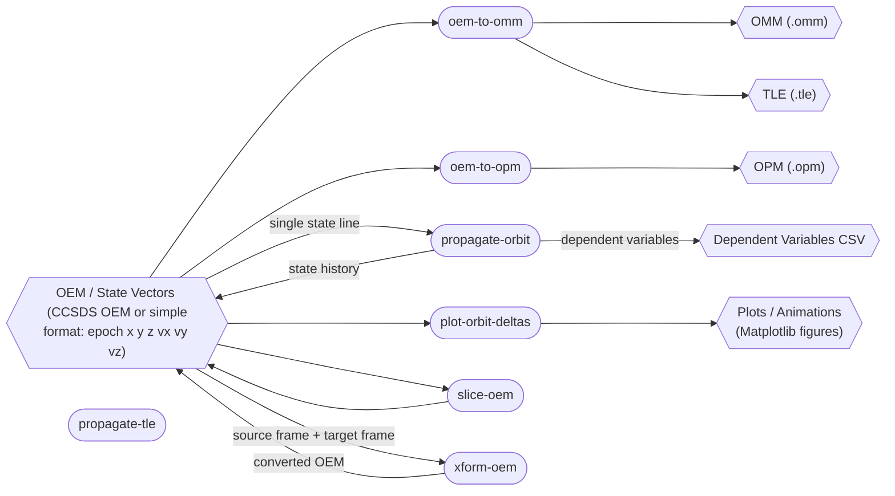
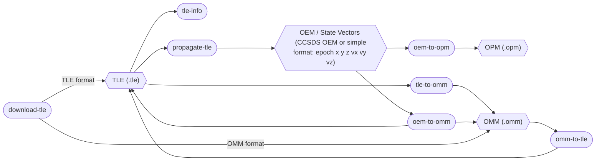

# ephem-toolkit

Command-line tools for processing, converting, propagating, comparing, and visualizing OEM, OPM, OMM, and TLE ephemeris data with TudatPy and Tudat.

## Overview

This project provides a practical toolkit for working with ephemerides and related astrodynamics data. Built on top of [TudatPy](https://docs.tudat.space/en/latest/) and [Tudat](https://docs.tudat.space/), it includes a focused set of command-line tools for ingesting, transforming, comparing, propagating, and plotting CCSDS OEM, OPM, OMM, and TLE data.

The toolkit supports workflows for working with ephemeris products: parse OEM, OMM, and TLE inputs, fit or convert mean elements, propagate trajectories, compare results, and visualize dependent variables and orbit differences.

### OEM file data flow



### OPM/OMM/TLE file data flow



---

## Command-Line Tools


| Workflow | Command |
| --- | --- |
| OEM comparison | [`diff-oem`](docs/DIFF_OEM.md) |
| TLE download | [`download-tle`](docs/DOWNLOAD_TLE.md) |
| OMM to TLE | [`omm-to-tle`](docs/OMM_TO_TLE.md) |
| OEM slicing | [`slice-oem`](docs/SLICE_OEM.md) |
| TLE inspection | [`tle-info`](docs/TLE_INFO.md) |
| TLE to OMM | [`tle-to-omm`](docs/TLE_TO_OMM.md) |
| OEM frame transformation | [`xform-oem`](docs/XFORM_OEM.md) |
| OEM to OPM fitting | [`oem-to-opm`](docs/OEM_TO_OPM.md) |
| OEM to OMM fitting | [`oem-to-omm`](docs/OEM_TO_OMM.md) |
| Orbit propagation | [`propagate-orbit`](docs/PROPAGATE_ORBIT.md) |
| Kepler propagation | [`propagate-kepler`](docs/PROPAGATE_KEPLER.md) |
| TLE propagation | [`propagate-tle`](docs/PROPAGATE_TLE.md) |
| Orbit plotting | [`plot-orbit`](docs/PLOT_ORBIT.md) |
| Orbit-delta plotting | [`plot-orbit-deltas`](docs/PLOT_ORBIT_DELTAS.md) |
| Dependent-variable plotting | [`plot-dependent-variables`](docs/PLOT_DEPENDENT_VARIABLES.md) |


TudatPy-dependent workflows require TudatPy and its transitive dependencies through an external installation method.

### OEM Utilities

- [`diff-oem`](docs/DIFF_OEM.md) — compare corresponding states from two OEM files with optional rotation fitting and time-shift correction.
- [`slice-oem`](docs/SLICE_OEM.md) — slice OEM files by index or time range (with optional interpolation).
- [`xform-oem`](docs/XFORM_OEM.md) — convert CCSDS OEM state vectors between supported reference frames, or convert ECEF positions to AER coordinates.


### Orbit Propagation

- [`propagate-orbit`](docs/PROPAGATE_ORBIT.md) — Cartesian state propagation with configurable perturbations
- [`propagate-kepler`](docs/PROPAGATE_KEPLER.md) — two-body Kepler propagation
- [`propagate-tle`](docs/PROPAGATE_TLE.md) — SGP4 TLE propagation

Supports CCSDS OEM export, data-only state-vector output, dependent-variable CSV export, and OEM metadata headers.

### OEM-to-OMM

- [`oem-to-omm`](docs/OEM_TO_OMM.md)

Estimates Orbit Mean-Elements Messages (OMM) including Two-Line Element (TLE) sets from OEM Cartesian state vectors. Fits OEM state vectors to osculating Kepler, mean Kepler, or TLE-derived OMM output using iterative least-squares fitting. Includes least-squares estimation, iterative refinement, SGP4 model evaluation, and TLE line construction.

### OEM-to-OPM

- [`oem-to-opm`](docs/OEM_TO_OPM.md)

Fits an OEM arc with a two-body osculating Keplerian model and writes an OPM containing the first OEM state and fitted elements.

### TLE / OMM Utilities

- [`download-tle`](docs/DOWNLOAD_TLE.md) — download TLE data
- [`omm-to-tle`](docs/OMM_TO_TLE.md) — convert OMM → TLE
- [`tle-to-omm`](docs/TLE_TO_OMM.md) — convert TLE → OMM
- [`tle-info`](docs/TLE_INFO.md) — inspect TLE information

### Visualization

- [`plot-orbit-deltas`](docs/PLOT_ORBIT_DELTAS.md) — plot and compare multiple orbits
- [`plot-dependent-variables`](docs/PLOT_DEPENDENT_VARIABLES.md) — plot dependent variables from propagation output

---

## Libraries

### Python Library (`src/ephem_toolkit/core/`)

Reusable Python modules providing foundational astrodynamics functionality. These are imported by the application modules and CLI tools.

**Key modules:**
- **Interpolation** — Hermite, Chebyshev, and Lagrange polynomial interpolators with configurable degree
- **CCSDS** — OEM, OPM, OMM, and ODM parsers and writers
- **Time utilities** — ISO 8601, duration parsing, time conversions
- **Orbital elements** — Cartesian ↔ Keplerian conversions, anomaly calculations
- **Coordinate transformations** — Frame conversions, WGS-84, AER coordinates
- **TLE utilities** — TLE parsing, validation, and conversions

See [CORE_LIBRARY_SUMMARY.md](docs/CORE_LIBRARY_SUMMARY.md) for an overview of all available modules and functions.

---

## Repository Layout

```
src/
├── ephem_toolkit/
│   ├── core/                 Shared Python library modules
│   │   ├── ccsds/            CCSDS ODM, OEM, and OMM definitions and parsers
│   │   ├── interpolator/     Public interpolation package for Lagrange, Hermite, Chebyshev, and spline methods
│   │   └── ...               Additional core astrodynamics and time utilities
│   ├── diff_oem/            OEM comparison application module
│   ├── download_tle/        TLE download utilities
│   ├── oem_to_omm/          OEM-to-OMM estimation application module (includes TLE fitting)
│   ├── oem_to_opm/          OEM-to-OPM osculating-element fitting application module
│   ├── omm_to_tle/          OMM-to-TLE conversion utilities
│   ├── plot_dep_vars/       Dependent-variable plotting utilities
│   ├── plot_orbit/          Orbit visualization utilities
│   ├── plot_orbit_deltas/   Orbit-difference plotting utilities
│   ├── propagate_kepler/    Kepler propagation package
│   ├── propagate_orbit/     Cartesian propagation package
│   ├── propagate_tle/       TLE propagation package
│   ├── slice_oem/           OEM slicing application module
│   ├── tle_info/            TLE inspection utilities
│   ├── tle_to_omm/          TLE-to-OMM conversion utilities
│   ├── xform_oem/           OEM frame transformation application module
│   └── */                   Other application modules
└── ...                     Other project source modules

tests/                      Unit tests and sample data files
docs/                       Documentation
README.md                   Project overview and usage guide
pyproject.toml              Project configuration and dependencies
```


## Build and Dependencies

### Python Tools

Typical Python dependencies used by the scripts:

- [TudatPy](https://docs.tudat.space/en/latest/) (`tudatpy`)
- NumPy

Some scripts use only the Python standard library plus local helpers.
